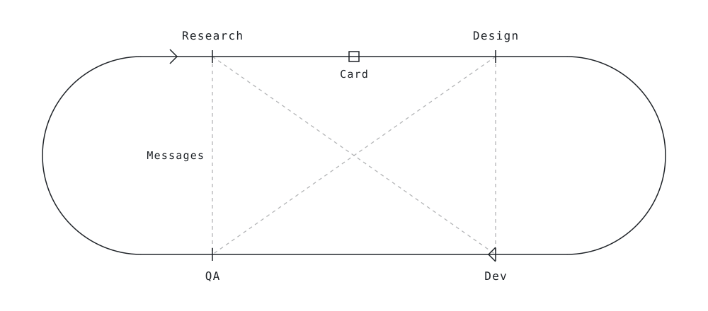

# Workflow harness

A team of Claude Code agents that plans, researches, designs, builds and reviews software. Each agent works
by written rules, and hooks enforce those rules as the agent works.

<picture>
  <source media="(prefers-color-scheme: dark)" srcset=".github/readme-topology-dark.svg">
  
</picture>

## The short version

Five agents, each in its own terminal, pass work across a Trello board. One of them, the orchestrator,
plans the work and writes the cards. The others research, design, build and review. Hooks keep each one in
its lane. You decide what gets built. When a decision is yours, an agent asks.

It runs on any stack. You need a Mac or Linux computer, Claude Code, and a kanban board. Trello is the
board adapter that ships. You should be comfortable working in a terminal app. The board and Storybook
have their own screens, but the work and the configuration happen in the terminal. Two lines install it.
The orchestrator then starts, speaks first, and walks you through the rest.

```bash
curl -fsSL https://raw.githubusercontent.com/jaymeany/workflow-harness/main/install.sh -o harness-install.sh
bash harness-install.sh
```

That's all you need to start. [`start-here/README.md`](start-here/README.md) is the walk-through if you
want one. Everything below is reference: how it's built, what the rules are, and how to change it.

I built this over a year of research and development, and I use it on my own work. Take it, change it, and
make it yours. If you want to talk about how it works or how to adapt it, reach me through my GitHub
profile, [@jaymeany](https://github.com/jaymeany).

## Contents

- [Install](#install)
- [Why the code holds up](#why-the-code-holds-up)
- [How a role is built](#how-a-role-is-built)
- [The roles](#the-roles)
- [How work moves](#how-work-moves)
- [What the hooks enforce](#what-the-hooks-enforce)
- [Adapt it and extend it](#adapt-it-and-extend-it)
- [What you need](#what-you-need)
- [Get a copy another way](#get-a-copy-another-way)
- [About](#about)
- [License](#license)

## Install

The two lines above download the install script and run it. The script checks that your computer has what
the hooks need, asks for a workspace name and a project name, downloads the harness into your home folder
under those names, and starts the orchestrator. It downloads to a file first so you can read it before you
run it.

It asks for two names and nothing else. It never asks for a key, a token or a password.

The orchestrator takes it from there. It speaks first, so there is nothing to paste and nothing to read
ahead of time. It walks you through git, Trello, your stack, the optional tools and the other agents, one
step at a time. You can stop at any point and pick up where you left off.

It is also where you go to change any of it later. A different board, a tool you skipped, a new branch
model, a folder rename. Start the orchestrator and say what you want. You don't need to remember what you
configured or what you left out. Ask it what is unset and it will tell you what each one affects, and
which ones don't matter.

See "What you need" below for the accounts and tools. The script checks the ones it can.

The tools in this harness are my answers to problems any agent workflow runs into. They're my personal
choices. You may have your own tooling for the same problems, and that's fine.

| Problem | My answer |
|---|---|
| Work has to persist across sessions and agents | Trello. Each card holds one unit of work and its context |
| Agents need to understand the codebase efficiently | Axon. It indexes the code into a graph agents can query |
| UI and interaction work has to be judged on the real thing | Storybook. It renders the project's real components, so what an agent sees is what ships |
| Review has to see the product the way a user does | Playwright MCP. It opens the product in a real browser for screenshots and checks |

Trello sits behind an adapter, so swapping it is a new adapter, not a rewrite. See "Use another board"
below. Storybook, Axon and Playwright MCP are optional.

## Why the code holds up

The quality comes from the structure.

- **Work is split by role.** Research documents, Design builds the surface, Dev writes the code, and QA
  reviews it. Each role owns the quality of its own domain.
- **Every claim rests on evidence.** Research cites the files it opened. Dev checks Research's findings
  before writing code. QA reads the changed files, not the card's account of them.
- **Review runs the product.** QA runs the project and opens every page the change touches. A pass needs
  runtime evidence. A file and line citation alone doesn't count.
- **Findings don't get dropped.** Every finding becomes a tracking card before a card can pass. A pass after
  a fail must show each required fix was checked. A review goes stale if the card changes after it.
- **Every change is traceable.** Each card's work lands in commits that start with the card number. The card
  carries the research, the implementation notes and the review.
- **The rules hold.** Hooks check them when an agent acts, and the docs tell the agent why each rule exists.

## How a role is built

Every role folder has the same shape, and each layer answers one question.

| Layer | File | Answers |
|---|---|---|
| Identity | `<Role>_Role.md` | Who the agent is. Disposition, mandate, hard constraints, tags |
| Protocol | `protocol/*.md` | How it works. Methodology, card mechanics, checks, templates |
| Place | `CLAUDE.md` | Where things live. Memory, handoffs, environment |
| Enforcement | `.claude/settings.json` and `.claude/hooks/` | What it can't do, checked when it tries |

At session start, hooks load the identity and protocol docs into context, so the agent begins in role from
its first turn.

The docs and hooks carry your standing intent, so you don't repeat it every session. The Research role doc
puts it this way: "A hook firing is the user speaking in the moment." When a hook blocks an agent, the agent
reads what the hook says and takes the correct path. If it's stuck, it says so and escalates.

## The roles

The team has five roles: Orchestrator, Research, Designer, Dev and QA. Each runs as its own Claude Code
session, in its own folder, with its own identity, mandate, protocol, hooks and memory. The roles message
each other directly when they need an answer.

### Orchestrator

The project manager. It owns the plan: what gets built, in what order, and whether a piece of work belongs
in the project at all.

Its mandate, in order: nobody blocked and nobody guessing, the right sequence, scope held, drift caught
early, and a plan that stays true. It holds the whole shape of the project and notices when a piece drifts.
It keeps the plan and the open decisions list current. It never lets an agent guess past a decision, and
never closes one itself.

It owns the plan and nothing else. Research, Design, Dev and QA each own the quality of their own domain.
The Orchestrator doesn't overrule them. It takes a disagreement to you.

Protocol: orienting each session, sequencing, scoping work, keeping the plan true, and where it stops.

### Research

The careful witness. It reads code and documents what exists: services, files, line ranges, dependencies and
blockers.

Code first, always. Every claim cites a file it opened. It doesn't prescribe how Dev implements, and it
doesn't invent decisions. Its findings become the evidence chain Dev and QA work from. It escalates to you
on low confidence, breaking changes, large schema changes and new external dependencies.

Protocol: tool selection, making each check fail once before trusting it, following the dependency chain,
confidence calibration, disagreement out loud, and sizing work.

### Designer

The design, UX and craft authority. Nobody overrules it on whether a design is good.

Its mandate, in order: a surface its users would screenshot, a system rather than a screen, motion that
carries meaning, fewer parts, and the boring correctness of focus, reduced motion, contrast and touch
targets. It works in Storybook, which renders the project's real components. It reaches in a fixed order:
an existing token, an existing component, the component library, another library, a new token surfaced on
purpose, and hand-written CSS last with a stated reason.

It records the decisions it made and the roads not taken.

Protocol: visualize first, the reach order, motion, judgment calls, and a nine-part craft bar every surface
must clear.

### Dev

The executor. It writes the code.

Its role doc describes the craft as restraint: ship the diff that solves the problem, and finish before
reaching for the next thing. Before writing code it reads the card, verifies Research's findings, reads the
token file and checks impact. When the research is wrong, it says so. It doesn't guess.

Protocol: the pre-implementation checklist, standards and anti-patterns, verification, definition of done,
implementation notes, clarification, partial completion and commit discipline.

### QA

The adversary. It reviews to find what's about to break.

Its mandate ranks a false or unsourced claim above an ordinary bug. Then come things published that
shouldn't be, weakened verification, and token drift. It runs the project and opens the page the card
touched and every page that links to it. A finding without a cited standard is a preference, not a finding.
A review with zero findings triggers a second look. Every finding is tracked. It tells an implementation
that missed the spec apart from a spec that couldn't be met.

QA keeps the test suite, the service registry and the docs repo, when the project has them.

Protocol: run it first, files first, token, security and content checks, surface and acceptance checks, the
decision matrix, the review template, iteration, hotfixes, and what not to flag.

## How work moves

```
Next ─┬─▶ Design ─▶ Research ─▶ Now ─▶ QA ─▶ Done
      └──────────────▲
```

A card starts in Next, written so the role that receives it can start without asking a question. It goes to
Design when the surface doesn't exist yet, or straight to Research when it does. Design hands it on to
Research, which writes the card Dev builds from.

**Research is what moves a card to Now.** It attaches the green Research complete label, and a hook checks
the card before the move. Dev commits the work under the card number, posts implementation notes and moves
the card to QA. A hook then hands Dev the next card in Now.

Work also goes backwards, and that's the flow working rather than failing:

| Move | Who | When |
|---|---|---|
| Now → Research | Dev | The research is wrong, or the card defers a decision Dev shouldn't make |
| Now → Design | Dev | The surface is the problem |
| QA → Done | QA | PASS |
| QA → Now | QA | FAIL, with the required fixes |
| QA → Research | QA | BOUNCE, the spec can't be met as written |
| QA → Design | QA | BOUNCE, the gap is in the design |
| new card → Research | QA | Every finding becomes a tracking card before a card can pass |

QA is the only role that moves a card out of QA, and the only one that moves a card to Done. The other way
into Now is a QA FAIL.

Each role with a column can arm a watcher: it polls that column every 20 seconds, read-only, and wakes the
agent only when a card arrives. It's a doorbell, and whether you want one is your call. Set `BOARD_WATCHER`
in `shared/preferences.conf` to `auto` for every role to arm on its first turn, `ask` to be offered it each
session, or `off`. Off is the default, and `/check-trello` reads the column on demand either way. The
orchestrator has no column and never arms one.

Trello holds the work. Each card is a persistent unit of work context. The research, design notes,
implementation notes and review stay on the card across sessions and agents. Moves, findings, reviews and
new work are card operations. A message is for a question. Agents message each other directly with Claude
Code's `ListAgents` and `SendMessage`. There is no bus or relay to run.

Each role keeps its own memory, separate from the other roles and from other projects on the same computer.
Each writes a handoff for its next session.

Tags on card titles carry status, such as `[Needs Decision]`, `[Needs Clarification]` and `[Blocked]`.
Labels carry state by color: green for Research complete, blue for Needs research, red for a QA FAIL, purple
for QA complete, orange for a tracking card. The hooks create a label when it's missing.

## What the hooks enforce

### Handoffs

- Research can't hand off a card without the required sections, with blocker tags, or with open questions.
  A card that touches more than three files must be split.
- Dev can't move a card to QA without complete implementation notes and a commit for that card.
- QA can't move a card out of QA without a review comment whose status matches the destination.
- A PASS needs a Verification section with runtime evidence: a command run, a page rendered, a record
  confirmed.
- A PASS after a FAIL must show that each required fix was checked.
- A move is denied if the card changed after QA wrote its review.
- A QA review can't say "minor gap" or "out of scope" unless the same line cites a tracking card.

### Lanes

- Research, Designer and Dev can only edit cards in their own column. Research may append a marked addendum
  to a card in Now.
- Designer, Dev and QA can't overwrite a card's description. Research can't post comments, and its
  description edits are append-only once a card leaves its column.
- Cards in Done can't be edited.
- Card titles follow one pattern: `#<number> <title> <Trello card id>`.
- Direct calls to the Trello API from the shell are blocked, so every card operation passes through the
  gates.

### Git

- The Orchestrator and Designer can't push. Merging and pushing is your call.
- A force push needs `--force-with-lease`.

### Continuity

- Context compaction is blocked until the role has written a handoff within the last hour.

## Adapt it and extend it

The harness fits your project, and it's built to be changed.

### Fit it to your project

- Any stack. The stack, commands, review bar and boundaries are filled in during setup.
- Your branch model. Work on a dev branch and merge to main, add a staging step, or use your own.
- The roles you need. Start with some and add the rest later.
- The tools that fit. Storybook, Playwright MCP and Axon are optional, and the orchestrator explains each.
- Your names. Rename the workspace and project folders. Rename a Trello column and keep its word
  (`research`, `design`, `now`, `qa`, `done`), and the hooks still find it.
- More than one project. Copy the project folder to add another.

### Change how it works

- The rules are files you can read. Roles and protocols are Markdown. Hooks are bash. Each hook entry in
  `settings.json` carries a comment, and each script's header explains what it checks and why.
- Project facts live in one place. Claude Code reads every `CLAUDE.md` from a session's folder up, so each
  role loads the workspace file, the project file, the docs file and its own. A board ID or branch rule is
  written once and reaches every role.
- Protocols grow by splitting. Claude Code caps what a startup hook can load. Each doc has its own loader,
  and a digest at startup warns when one crosses the cap.
- New hooks are audited without changes. Hooks fail open when a tool or Trello variable is missing. An
  audit at startup reads each hook's header and names every hook in that state, so a new hook that follows
  the header convention is covered.
- Setup is a script. The files ship with placeholders, and the orchestrator fills them in with you. Until it
  does, every other role refuses to work and tells you to start the orchestrator.

### Use another board

Trello is the adapter that ships. The hooks never call it directly. They call the board layer:

```
docs/agent-workflows/board/
├── board.conf          the adapter in use, and the board id
├── CONTRACT.md         what an adapter must provide
└── adapters/trello/    tool names, board calls, state labels, the watcher loop
```

To move to another board, add a folder beside `adapters/trello/` and name it in `board.conf`. `CONTRACT.md`
lists what an adapter provides: read a card, read a column, list the cards in a column, read a card's notes,
find or create the state labels, move a card, rename it, add and remove labels.

The rest is shared and stays put, including the column rule, the reader that turns a tool call into a board
action, and the watcher. The hooks don't change.

## What you need

- A Mac or Linux computer. On Windows, use WSL or Git Bash.
- Claude Code 2.1.224 or later.
- A kanban board. The board is where the agents pass work. Trello is the adapter that ships, so with it you
  need a Trello account, API key and token, and the Trello MCP server,
  [`@delorenj/mcp-server-trello`](https://github.com/delorenj/mcp-server-trello). It isn't included. See
  "Use another board" to swap Trello out.
- `jq`, `curl`, `pgrep` and `git`.

Git and GitHub are optional.

## Get a copy another way

The install script is the short path. Two others work:

- Fork this repo on GitHub if you want to send improvements back.
- Download the ZIP. On the repo page, choose Code, then Download ZIP, and unzip it.

Either way you then start the orchestrator yourself:

```bash
cd Primary-project-name/app-or-project-name/docs/agent-workflows/orchestrator
claude
```

You do not need to say anything in particular. The orchestrator checks for itself whether setup has been
done and leads with it. [`start-here/README.md`](start-here/README.md) is the longer walk-through.

Your copy is yours. Changes you make to it don't touch this repo.

## About

Built by Jay Meany, [@jaymeany](https://github.com/jaymeany) on GitHub.

## License

CC0 1.0 Universal. The work is dedicated to the public domain, so you can copy, change and share it for any
purpose without asking. See [LICENSE](LICENSE).
